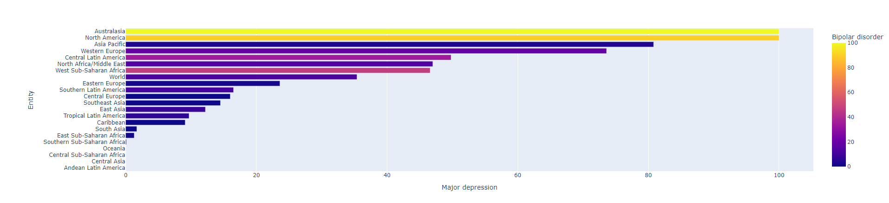
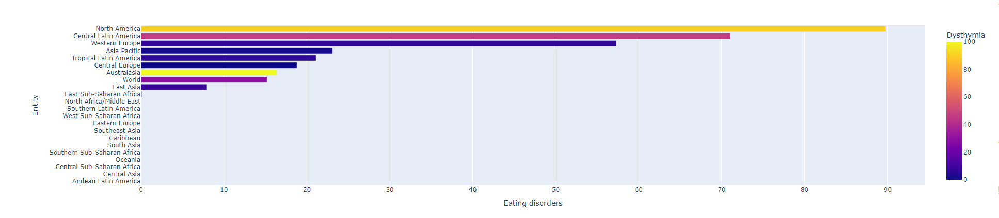
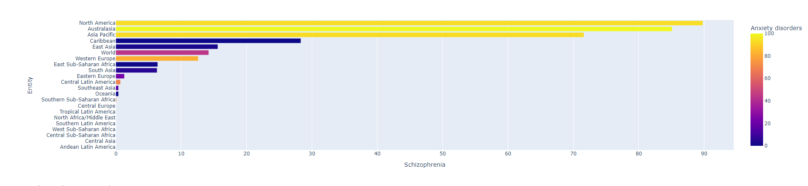
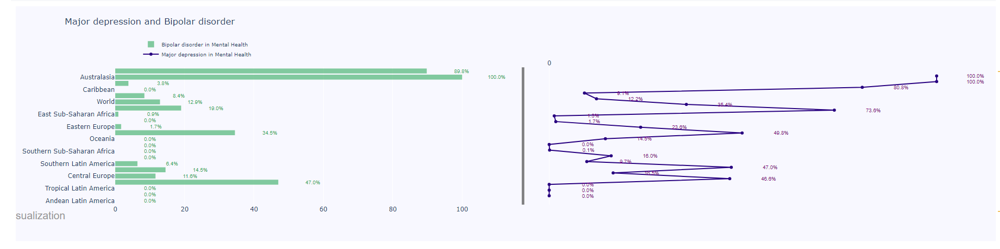
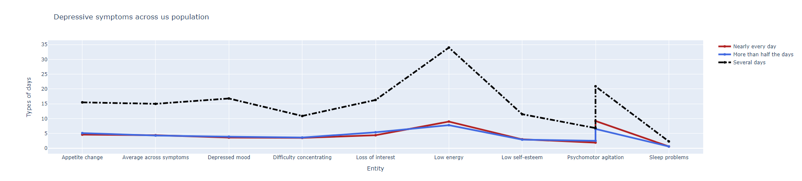
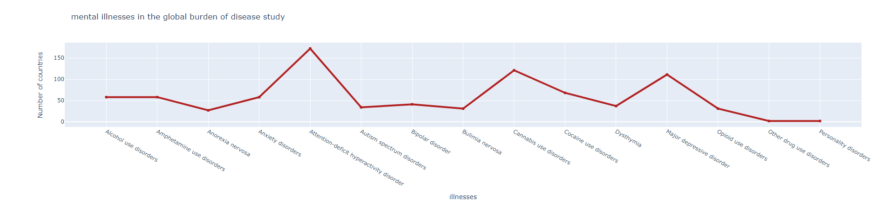

# MentalHealthDataPipeline

## Project Overview

This project demonstrates a simple data pipeline for processing public mental health data, analyze it and upload it to an AWS S3 bucket. The project loads data from Kaggle datasets, processes it using Python, and uploads the resulting data to AWS S3.

The project is containerized using Docker, allowing for easy deployment and portability. AWS credentials are securely handled through environment variables passed at runtime.

## Contents

- `README.md`: This file.
- `requirements.txt`: Python dependencies.
- `src/data_loader.py`: Script to load data.
- `src/s3_uploader.py`: Script to upload data to S3.
- `src/pipeline.py`: Main pipeline script.
- `mental-health-eda-prediction.ipynb`: Jupyter notebook for exploratory data analysis and prediction of mental health trends.

## mental-health-eda-prediction.ipynb

The `mental-health-eda-prediction.ipynb` notebook includes the following sections:

1. **Introduction**: Overview of the dataset and the objectives of the analysis.
2. **Data Preprocessing**: Steps taken to clean and prepare the data for analysis.
3. **Exploratory Data Analysis (EDA)**: Visualizations and descriptive statistics to understand the data.
4. **Model Training and Prediction**: Machine learning models to predict mental health trends.
5. **Conclusion**: Summary of findings and potential implications.

To run the notebook, make sure you have Jupyter installed and execute the following command:

```sh
jupyter notebook mental-health-eda-prediction.ipynb
```

## Getting Started

### 1. Prerequisites

- Python 3.9+
- Docker installed
- AWS Account with an S3 bucket

### 2. Installation

Clone the repository to your local machine:

git clone https://github.com/JUnelus/MentalHealthDataPipeline cd MentalHealthDataPipeline


Install the required dependencies:

pip install -r requirements.txt


### 3. AWS Setup

Ensure your AWS credentials are set up correctly. You can pass the AWS credentials using an `.env` file:

AWS_ACCESS_KEY_ID=your_access_key AWS_SECRET_ACCESS_KEY=your_secret_key AWS_REGION=your_region AWS_S3_BUCKET_NAME=your_bucket_name


### 4. Running the Project

#### Option 1: Running Locally

Run the pipeline locally using the following command:

python src/pipeline.py


#### Option 2: Running with Docker

To run the project inside a Docker container, first build the Docker image:

docker build -t mental_health_pipeline .

Then run the container with the AWS credentials passed via an `.env` file:

docker run --env-file .env mental_health_pipeline


### 5. Output

The processed mental health data will be uploaded to the specified AWS S3 bucket.

## Dashboard

The processed mental health data can be visualized using a dashboard. The dashboard is built using Plotly Dash and can be run locally as follows:








## Contributing

Feel free to submit issues or pull requests if you want to contribute to this project.